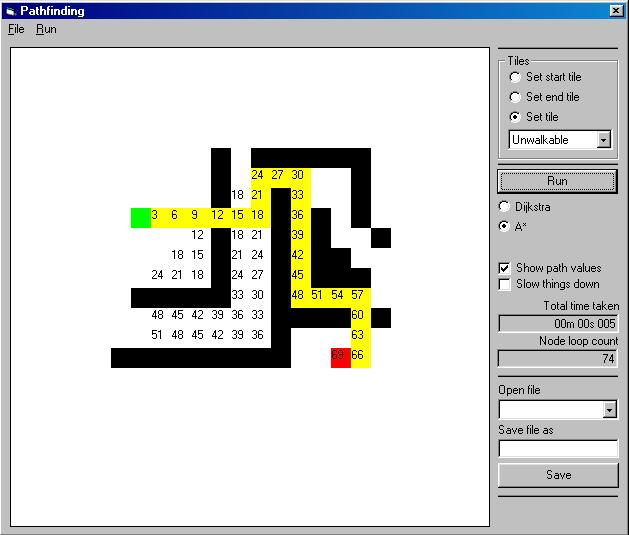



## \_\_v2 A\* \(A star\) and Dijkstra game pathfinding for tile games

### Description

v2 ! Improved speed of A* and Dijkstra pathfinding !!! I love computer tile games (Heroes of Might & Magic, etc...) and have always brought interest to such game programming technics. The code example below presents fast bitblt through an array and onto a picturebox. This method is faster than usual loop through array. This method is usefull only for games that use LoadRessource, LoadPicture functions (or similar home-made ressource loading) since it loads each picture once. The other example is plain pathfinding. It figures out fastest way to go from one point to another according to terrain difficulties. It implements two famous methods : Dijkstra & A* (a star). Please send me any interesting paths so I can add them to the zip. If you know how to improve this pathfinding, please email me, I'll be very happy to recieve usefull feedback. The A* can still be deeply improved, if you wish more details, read the comments inside the code. Maybe making the thread priority temporarily to a higher level or even multi-threading could improve the speed.

     

Vote for me if you like this code !
 
### More Info
 

             |
---                |---
**Submitted On**   |2002-02-10 13:29:34
**By**             |[Julien Lecomte](https://github.com/Planet-Source-Code/PSCIndex/blob/master/ByAuthor/julien-lecomte.md)
**Level**          |Intermediate
**User Rating**    |4.8 (87 globes from 18 users)
**Compatibility**  |VB 5\.0, VB 6\.0
**Category**       |[Games](https://github.com/Planet-Source-Code/PSCIndex/blob/master/ByCategory/games__1-38.md)
**World**          |[Visual Basic](https://github.com/Planet-Source-Code/PSCIndex/blob/master/ByWorld/visual-basic.md)
**Archive File**   |[\_\_v2\_A\_\_\(A543672102002\.zip](https://github.com/Planet-Source-Code/julien-lecomte-v2-a-a-star-and-dijkstra-game-pathfinding-for-tile-games__1-31654/archive/master.zip)

